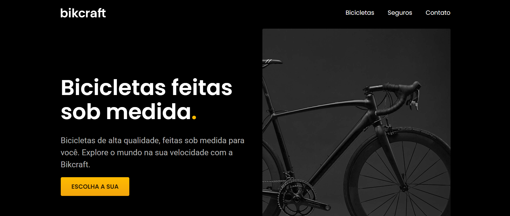
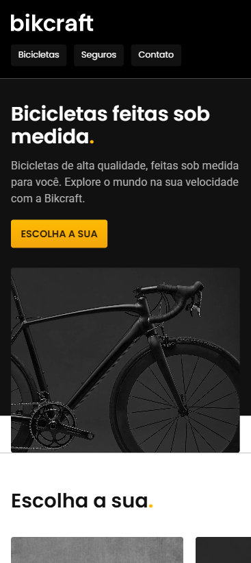

# Bikcraft

Site institucional e catálogo de bicicletas premium feitas sob medida, desenvolvido durante o curso de HTML e CSS da [Origamid](https://www.origamid.com/).

## Preview

### Desktop

<p align="center">
  
</p>

### Mobile

<p align="center">
  
</p>

## Sobre o Projeto

Bikcraft é um site completo para uma marca fictícia de bicicletas elétricas premium de fibra de carbono, com GPS integrado, feitas sob medida no Rio de Janeiro. O projeto foi desenvolvido como prática do curso da Origamid, aplicando conceitos de HTML semântico, CSS modular e JavaScript vanilla.

## Funcionalidades

- **Hero Section** com call-to-action e imagem responsiva via `<picture>`
- **Catálogo de Bicicletas** com 3 modelos (Nimbus, Nebula, Magic) e páginas de detalhe
- **Galeria de Imagens** interativa nas páginas de produto
- **Planos de Seguro** com comparativo de funcionalidades (Prata e Ouro)
- **FAQ Accordion** com perguntas frequentes e acessibilidade (`aria-expanded`)
- **Formulário de Orçamento** com pré-seleção via query params na URL
- **Formulário de Contato** com dados das lojas físicas (RJ e SP)
- **Animações de Scroll** com plugin SimpleAnime (fadeIn, slide directions)
- **Navegação ativa** destacando a página atual no menu
- **Layout 100% Responsivo** com imagens adaptativas
- **HTML Semântico** com landmarks, `aria-label` e acessibilidade
- **Seção de Parceiros** e **Depoimento** de cliente
- **Página de Termos e Condições**

## Páginas

| Página | Descrição |
|--------|-----------|
| `index.html` | Home com hero, catálogo, tecnologia, parceiros, depoimento e seguros |
| `bicicletas.html` | Lista completa de bicicletas com specs |
| `bicicletas/nimbus.html` | Detalhe da Nimbus Stark (R$4.999) |
| `bicicletas/nebula.html` | Detalhe da Nebula Cosmic (R$3.999) |
| `bicicletas/magic.html` | Detalhe da Magic Might (R$2.499) |
| `orcamento.html` | Formulário de orçamento com seleção de produto |
| `seguros.html` | Planos de seguro, vantagens e FAQ |
| `contato.html` | Formulário de contato e localização das lojas |
| `termos.html` | Termos e condições de uso |

## Estrutura do Projeto

```
bikcraft/
├── index.html                     # Página principal
├── bicicletas.html                # Catálogo de bicicletas
├── contato.html                   # Página de contato
├── orcamento.html                 # Formulário de orçamento
├── seguros.html                   # Planos de seguro
├── termos.html                    # Termos e condições
├── bicicletas/
│   ├── magic.html                 # Detalhe - Magic Might
│   ├── nebula.html                # Detalhe - Nebula Cosmic
│   └── nimbus.html                # Detalhe - Nimbus Stark
├── css/
│   ├── style.css                  # Arquivo principal (imports)
│   ├── global.css/                # Reset, header, footer
│   ├── utilidades/                # Cores, tipografia, componentes, animações
│   ├── home/                      # Estilos da home (intro, tech, depoimento, parceiros)
│   ├── bicicletas/                # Estilos do catálogo
│   ├── bicicleta/                 # Estilos da página de detalhe
│   ├── seguros/                   # Estilos dos seguros
│   ├── contato/                   # Estilos do contato e lojas
│   ├── orcamento/                 # Estilos do orçamento
│   └── termos/                    # Estilos dos termos
├── js/
│   ├── script.js                  # Navegação ativa, accordion, galeria, query params
│   └── plugins/
│       └── simple-anime.js        # Plugin de animações no scroll
└── img/                           # Imagens, ícones SVG, fotos e logos
```

## Tecnologias

- **HTML5** — Estrutura semântica com `<article>`, `<section>`, `<nav>`, `<address>`
- **CSS3** — Arquitetura modular com `@import`, utility classes, animações com `transform`
- **JavaScript ES6+** — Vanilla JS com `classList`, `URLSearchParams`, event delegation
- **Google Fonts** — Merriweather, Poppins e Roboto
- **SimpleAnime** — Plugin para animações de entrada no scroll

## Como rodar o projeto

Por ser um site estático (HTML, CSS e JS puro), basta abrir o `index.html` no navegador ou usar um servidor local:

> Recomendado: use a extensão **Live Server** no VS Code para recarregamento automático.

## Créditos

Projeto desenvolvido durante o curso de **HTML e CSS para Iniciantes** da [Origamid](https://www.origamid.com/). Todo o design, conteúdo e estrutura do projeto foram criados como material didático do curso.

## Licença

Este projeto é apenas para fins educacionais.
